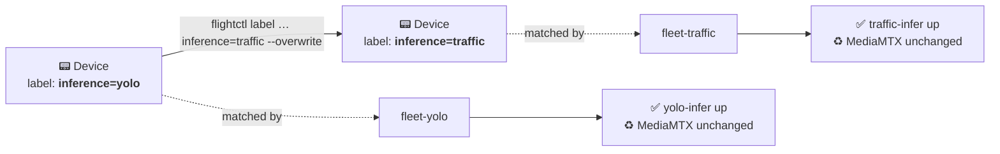

<div align="center">

# 🦊 mangey-moose

### Edge-AI flight stack for the Inari Watch wildfire-detection UAV

*Immutable RHEL at the edge of the wilderness. Swappable inference. Zero-touch fleet ops.*


</div>

---

## What this is

`mangey-moose` is the **onboard intelligence layer** for a fixed-wing wildfire-detection drone. It turns a [Flightory Moose](https://flightory.com/product/moose/) airframe + an NVIDIA Jetson into a self-managing edge node that runs computer-vision inference in flight and streams results to the ground in near-real-time.

The whole node is built as an **immutable, image-based Linux system** ([RHEL bootc](https://docs.redhat.com/en/documentation/red_hat_enterprise_linux/9/html/using_image_mode_for_rhel_to_build_deploy_and_manage_operating_systems)) and managed as a fleet over the air by [Red Hat Edge Manager](https://docs.redhat.com/en/documentation/red_hat_build_of_microshift) (the productized [flightctl](https://github.com/flightctl/flightctl)). You build a base OS image, flash it once, and from then on the device pulls its workloads and updates by reconciling against a declarative fleet spec — GitOps, but for a drone.

> [!NOTE]
> This repo is the **edge compute stack** — the OS image, the inference containers, and the fleet manifests. The airframe wiring, autopilot tuning, and RF links live in the build log, not here. The Walksnail FPV link is **completely separate** from this CV pipeline by design (see [Design notes](#-design-notes)).

## Mission context

Part of **[Inari Watch](https://github.com/ghengis-gohan)** — a veteran-founded effort building a system-of-systems for regional wildfire defense, named for *Inari*, the Shinto fox deity associated with recovery from disaster. The guiding principle is **detection before suppression**: the Moose is a patrol-and-detect platform that flies large areas, finds ignition sources early, and cues human-authorized response. It does not act autonomously on the world. Bounded autonomy, human in the loop, always.

---

## 🗺️ System architecture

```mermaid
flowchart TB
    subgraph AIR["🛩️  Moose airframe"]
        CAM["📷 CSI / USB camera<br/>/dev/video0"]
        CUBE["🧭 Cube Orange+<br/>ArduPilot · MAVLink"]
        WS["📡 Walksnail VTX<br/>pilot FPV — separate path"]
        subgraph JET["⚙️  Jetson Orin Nano · RHEL 9.4 bootc"]
            MI["model-init<br/><i>one-shot TRT export</i>"]
            INF["yolo-infer / traffic-infer<br/><b>swappable workload</b>"]
            MTX["MediaMTX<br/>RTSP · WHEP · HLS"]
        end
    end
    GS["🖥️  Ground station<br/>ffplay / VLC / browser"]
    RHEM["☁️  Red Hat Edge Manager<br/>declarative fleet"]

    CAM -->|frames| INF
    MI -.builds .engine.-> INF
    INF -->|publish /infer| MTX
    MTX -->|RTSP/WHEP over WiFi| GS
    CUBE -.MAVLink telemetry.-> GS
    WS -.5.8 GHz.-> GS
    RHEM <-.enroll · reconcile · update.-> JET

    classDef sep stroke-dasharray:4 4,fill:#fef6f0,stroke:#d85a30;
    class WS sep;
```

The Jetson runs a small set of containers under rootful `podman`, orchestrated by the flightctl agent. The autopilot and the FPV transmitter share the airframe but **not** the compute pipeline.

---

## 📦 The container stack

Four images, each with one job. Built natively on the Jetson (`aarch64`), pushed to Quay, deployed by RHEM.

| Container | Lifecycle | GPU | Role |
|---|---|---|---|
| **`mediamtx`** | always on | no | RTSP/WHEP/HLS server. The streaming anchor — receives one publisher, fans out to any number of viewers. |
| **`model-init`** | run once, exits | yes | Compiles `yolov8n.pt` → a TensorRT `.engine` tuned for *this exact* GPU + TRT version, writes it to the shared model volume, then exits. |
| **`yolo-infer`** | swappable **(A)** | yes | YOLOv8n object detection on the live camera feed → annotated H.264 → publishes to `/infer`. |
| **`traffic-infer`** | swappable **(B)** | yes | DeepStream/ResNet traffic-classification pipeline → publishes to the **same** `/infer` path. |

Only **one** inference workload runs at a time. `mediamtx` and the model volume are shared infrastructure that both workloads depend on.

### 🔀 The swappable-workload design

The clever bit. `yolo-infer` and `traffic-infer` both publish to the identical RTSP path (`rtsp://127.0.0.1:8554/infer`), and `mediamtx` is defined **byte-for-byte identically** in both fleet specs. The consequences:

- The **ground-station URL never changes** when you swap workloads — `rtsp://<jetson>:8554/infer` always works.
- Swapping is just **relabeling the device**. RHEM tears down the old workload and brings up the new one; because the MediaMTX block is identical, it's left running untouched and the stream never drops.



> [!WARNING]
> Because the swap relies on the MediaMTX block being identical across `fleet-yolo.yaml` and `fleet-traffic.yaml`, **any edit to that block must be made in both files simultaneously** — otherwise a swap will needlessly cycle the server and drop the stream.

---

## 🌊 Data flow

```
📷 camera (/dev/video0)
      │  frames
      ▼
┌─────────────────────────────────────────────┐
│  yolo-infer  OR  traffic-infer               │
│  read → infer → annotate → NVENC → RTSP push │
└─────────────────────────────────────────────┘
      │  rtsp://127.0.0.1:8554/infer   (loopback, host net)
      ▼
┌─────────────────────────────────────────────┐
│  mediamtx — receive publish, fan out          │
└─────────────────────────────────────────────┘
      │  rtsp://$JETSON_IP:8554/infer  ·  WHEP :8889  ·  HLS :8888
      ▼  (over WiFi / radio link)
🖥️  ground station — ffplay / VLC / browser
```

---

## 🛩️ Hardware platform

| Subsystem | Part | Notes |
|---|---|---|
| Airframe | Flightory Moose | 1.6 m wingspan, V-tail, twin pusher, 2–4.5 kg AUW |
| Companion compute | Jetson Orin Nano Dev Kit | runs this entire stack |
| Flight controller | CubePilot **Cube Orange+** | ArduPilot; NDAA path is Cube Blue (post-Phase I) |
| FPV / pilot video | Walksnail Avatar HD Pro | **separate** from the CV pipeline |
| Telemetry | SiK V3 / RFD900x | MAVLink ↔ ground station |
| Power | 4S LiPo (6.5 Ah / 13 Ah) | Li-Ion pack for long-endurance range tests |

---

## 🗂️ Repository layout

```
mangey-moose/
├── base-image/                 # The immutable RHEL bootc OS
│   ├── Containerfile           #   RHEL 9.4 bootc + Jetson L4T (JP6.1) + flightctl-agent
│   ├── moose.ks                #   kickstart: disk, first-boot WiFi, SSH key, hostname
│   ├── config.yaml             #   flightctl enrollment config  ⚠️ see Secrets
│   └── nvidia-cdi.service      #   regenerates the CDI GPU spec on every boot
│
├── fleet-specs/                # What RHEM actually deploys (source of truth)
│   ├── fleet-yolo.yaml         #   mediamtx + model-init + yolo-infer
│   ├── fleet-traffic.yaml      #   mediamtx + traffic-infer
│   └── compose/                #   standalone composes — local testing convenience only
│
├── mediamtx/                   # Streaming anchor (Go, multi-arch, no GPU)
├── model-init/                 # One-shot TRT engine export (ships yolov8n.pt)
├── yolo-infer/                 # YOLOv8n inference → RTSP   (workload A)
├── traffic-infer/              # DeepStream traffic inference → RTSP   (workload B)
│
├── ground-station/
│   └── view-stream.sh          # pull the stream from a laptop
├── *_test.sh                   # per-container local smoke tests
├── swap_workflow.sh            # yolo ↔ traffic relabel (the swap, scripted)
├── data-flow · runtime-layout  # architecture notes
└── README.md                   # you are here
```

---

## ✅ Prerequisites

**Build host — the Jetson (`aarch64`).** Everything that produces an ARM artifact builds here: the base OS image pulls aarch64 L4T RPMs and runs `bootc container lint`, the inference images are L4T/DeepStream, and even MediaMTX's self-check needs ARM execution. Don't try to build these on an x86 box.

- `podman` (rootful) on the Jetson, JetPack 6.1 BSP
- Registry logins: `registry.redhat.io` (bootc base), `nvcr.io` (L4T images), `quay.io` (push target)
- A Red Hat subscription (the base image registers during build)

**Control host — your Fedora x86 workstation.** Editing, `git`, and driving the `flightctl` CLI against the Edge Manager service.

> [!IMPORTANT]
> The Orin Nano does **not** boot generic installer media out of the box. Flash the JetPack 6.1 UEFI/QSPI firmware first; after that it boots USB/NVMe like any aarch64 UEFI machine.

---

## 🚀 Build & deploy

Three phases: bake the OS → publish the workloads → hand it to the fleet.

<details>
<summary><b>Phase 1 — Base OS image → bootable USB</b> (on the Jetson)</summary>

```bash
# 1. Render the kickstart — fill in the tokenized WiFi PSK (and SSH key, if tokenized)
sed "s|###SSID_PASSWD###|$WIFI_PSK|" base-image/moose.ks > /tmp/moose.rendered.ks

# 2. Build & push the bootc base image
sudo podman login registry.redhat.io
cd base-image
sudo podman build \
  --build-arg RH_REG_USERNAME="$RH_USER" \
  --build-arg RH_REG_PASSWD="$RH_PASS" \
  --build-arg USER_PASSWD="$DEVICE_PASS" \
  -t quay.io/rh-ee-soanders/mangey-moose:latest .
sudo podman login quay.io
sudo podman push quay.io/rh-ee-soanders/mangey-moose:latest

# 3. Turn it into an installer ISO (native aarch64 → runs on the Jetson)
mkdir -p ~/output
sudo podman run --rm -it --privileged --pull=newer \
  --security-opt label=type:unconfined_t \
  -v /var/lib/containers/storage:/var/lib/containers/storage \
  -v ~/output:/output \
  registry.redhat.io/rhel9/bootc-image-builder:latest \
  --type iso \
  quay.io/rh-ee-soanders/mangey-moose:latest

# 4. Write to USB, boot the Jetson (UEFI firmware must already be flashed)
sudo dd if=~/output/bootiso/install.iso of=/dev/sdX bs=4M status=progress oflag=direct && sync
```

</details>

<details>
<summary><b>Phase 2 — Inference containers → Quay</b> (on the Jetson)</summary>

```bash
sudo podman login nvcr.io            # username: $oauthtoken  ·  password: NGC API key
sudo podman login quay.io

ORG=quay.io/rh-ee-soanders
for app in mediamtx model-init yolo-infer traffic-infer; do
  case $app in
    mediamtx) tag=$ORG/mangey-moose-mediamtx:v1.17.1 ;;
    *)        tag=$ORG/mangey-moose-$app:v1 ;;
  esac
  sudo podman build -t "$tag" "$app/"   # files are 'Containerfile' → auto-detected
  sudo podman push "$tag"
done
```

Make the Quay repos **public** for the prototype, or attach an image pull secret to the device in RHEM.

</details>

<details>
<summary><b>Phase 3 — Enroll & deploy via Red Hat Edge Manager</b> (from Fedora)</summary>

```bash
# Point the CLI at your Edge Manager instance
flightctl login https://api.flightctl.<your-domain> --web

# Boot the Jetson → it appears as pending enrollment → approve & label it
flightctl get devices
flightctl label device <device-name> purpose=drone-edge inference=yolo

# Apply the fleet (selector matches the labels above)
flightctl apply -f fleet-specs/fleet-yolo.yaml
flightctl get fleet drone-edge-yolo -o yaml
```

RHEM confirms the OS image matches, runs `model-init` once, then brings up `yolo-infer` + `mediamtx`.

</details>

---

## 🧪 Local testing (before involving the fleet)

Prove the camera → inference → MediaMTX → ground-station path on the bench first. On the Jetson:

```bash
bash model_init_test.sh     # builds yolov8n.engine, watch for "[model-init] done."
bash mediamtx_test.sh       # start the streaming anchor
bash yolo_infer_test.sh     # start inference, publishes to /infer
```

Then from your ground-station laptop:

```bash
export JETSON_IP=<jetson-ip>
bash ground-station/view-stream.sh        # ffplay, low-latency RTSP
# …or open http://<jetson-ip>:8889/infer  in a browser (WHEP, sub-second)
```

---

## 🔀 Swapping workloads

```bash
# yolo  →  traffic
flightctl apply -f fleet-specs/fleet-traffic.yaml      # one-time
flightctl label device <device-name> inference=traffic --overwrite
```

The device drops out of `fleet-yolo`'s selector and into `fleet-traffic`'s. `yolo-infer` comes down, `traffic-infer` comes up, MediaMTX keeps running, and `rtsp://<jetson>:8554/infer` never changes. Flip `inference=yolo` to roll back.

---

## 📺 Viewing the stream

| Method | Endpoint | Latency |
|---|---|---|
| `ffplay` (recommended) | `rtsp://<jetson>:8554/infer` | lowest |
| VLC | `rtsp://<jetson>:8554/infer` | low |
| Browser (WHEP) | `http://<jetson>:8889/infer` | sub-second |
| Browser (HLS) | `http://<jetson>:8888/infer` | ~2–5 s |

RTSP is TCP-only for reliability over WiFi. Jetson and ground station must share a network.

---

## 🧠 Design notes

A few decisions that look odd until you know why:

- **Two video paths, never crossed.** The Walksnail FPV link carries *pilot* video for line-of-sight flying. This CV pipeline is a *separate* camera → Jetson → inference → MediaMTX path. Detections are data; pilot video is a safety system. Conflating them would couple a mission feature to a flight-critical link.
- **TensorRT engines are built on-device.** A `.engine` is specific to the exact GPU and TRT version that compiled it — it is **not** portable. That's why `model-init` runs *on the Jetson* at first boot instead of shipping a prebuilt engine. `model-init` and `yolo-infer` therefore share a base image so the engine deserializes cleanly.
- **MediaMTX is byte-for-byte identical across fleets** so workload swaps don't cycle it. See the warning above.
- **Immutable OS, mutable workloads.** The OS is a versioned bootc image; you don't `dnf install` on a flying drone. Workloads are containers reconciled by RHEM. Rollback is a label flip or an image-tag bump, not a re-flash.
- **Fly first, then see, then close the loop.** Airframe and autopilot are validated before any vision work; the Jetson stack is integrated post-flight. (The IR/thermal ignition detector and any autonomy loop are explicitly future work.)

---

## 🔐 Secrets

`base-image/config.yaml` carries a flightctl **enrollment credential** (an EC private key). It is currently committed against an ephemeral lab cluster. Before moving to a durable Edge Manager instance:

```bash
echo "base-image/config.yaml" >> .gitignore
```

…and inject the enrollment config at build time, the same way the WiFi PSK is tokenized in `moose.ks`. A WiFi PSK and an enrollment key are secrets; an SSH **public** key is not (it's safe to commit).

---

## 🗺️ Roadmap

- [x] Airframe + autopilot bring-up (Phase 0)
- [x] Containerized CV stack — YOLO + traffic POC workloads
- [x] bootc base image + RHEM fleet management
- [ ] First autonomous flight + telemetry range validation
- [ ] **Thermal/radiometric ignition detector** (LWIR) as the primary wildfire workload
- [ ] Detection → MAVLink → autonomous orbit-and-cue workflow
- [ ] NDAA-compliant variant (Cube Blue, FLIR Boson+, mesh datalink)
- [ ] Phase I SBIR deliverables

---

## ⚠️ Safety & scope

This is a **detection and patrol** platform. It observes and reports; it does not suppress, and it does not act on the physical world without human authorization. Any future autonomy is bounded and human-in-the-loop by design. Fly responsibly, within FAA rules (Part 107 / BVLOS waivers as applicable), and clear of active fire operations and crewed aircraft.

---

## 🙏 Credits

Built on the shoulders of [ArduPilot](https://ardupilot.org/), [MediaMTX](https://github.com/bluenviron/mediamtx), [Ultralytics YOLO](https://github.com/ultralytics/ultralytics), [NVIDIA DeepStream](https://developer.nvidia.com/deepstream-sdk), [RHEL image mode](https://docs.redhat.com/en/documentation/red_hat_enterprise_linux/9), and [flightctl](https://github.com/flightctl/flightctl). Edge-AI pattern descends from **Project F.A.L.C.O.N.**

## License

© Inari Watch. All rights reserved. *(Proprietary — update this line if you intend to open-source.)*

<div align="center">
<sub>🦊 <i>The fox watches the hills.</i></sub>
</div>
